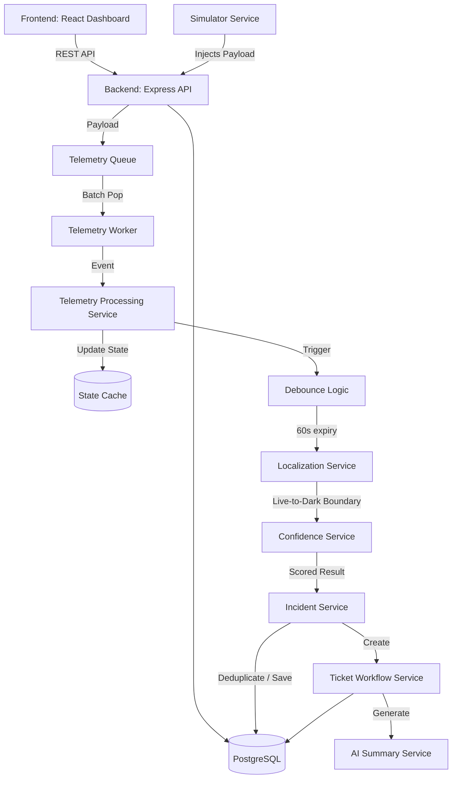
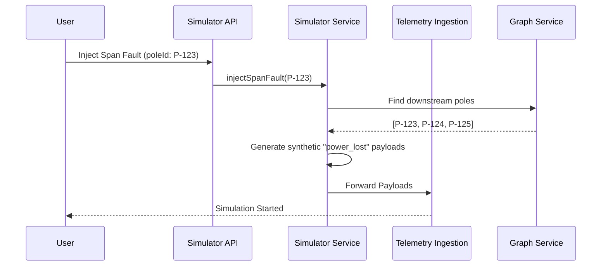
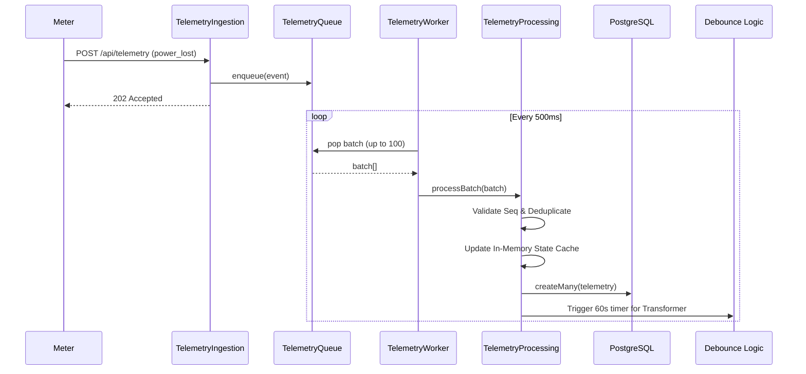
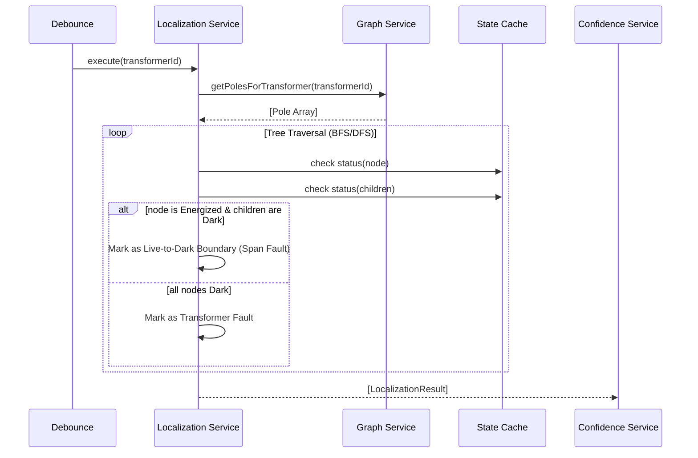
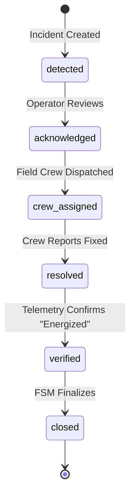
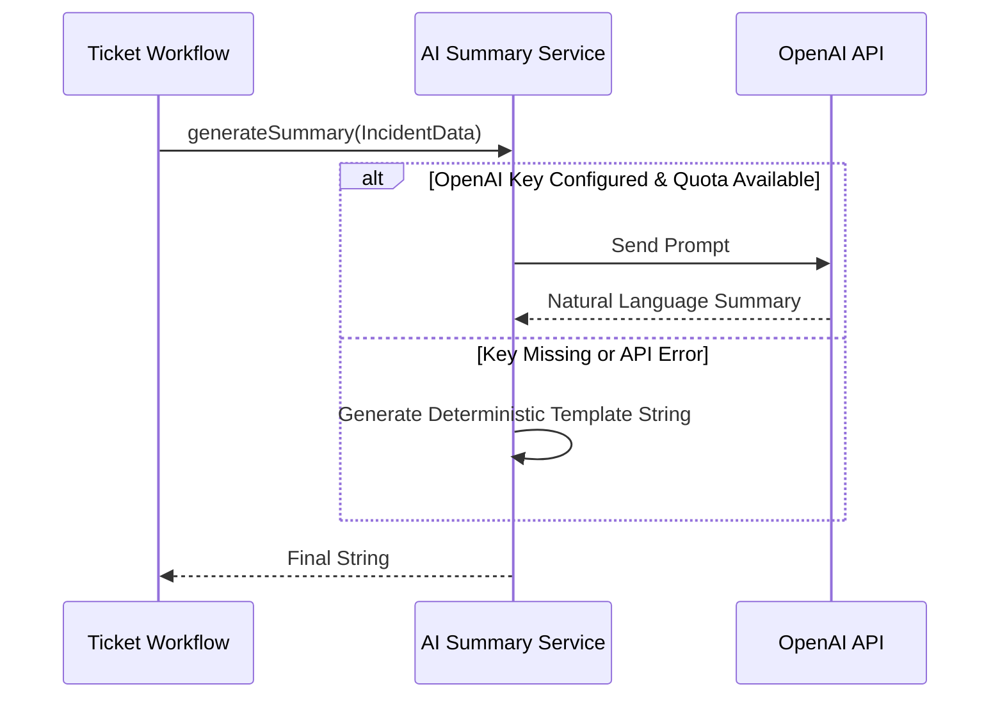
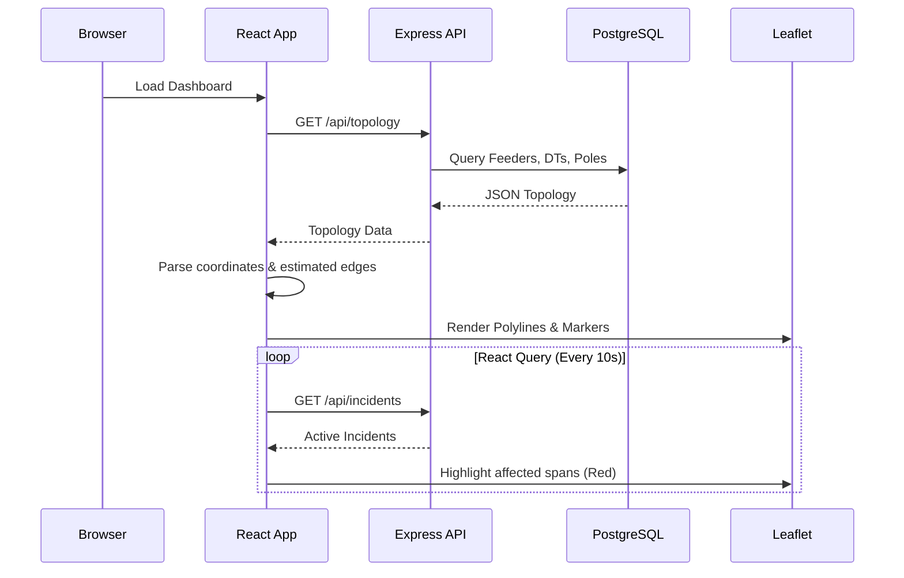

# Architecture Documentation

This document describes the high-level architecture, module responsibilities, and data flows of PropelAI.

## Overall System Diagram

---

## 1. Simulator Flow

**Responsibility**: Generate synthetic fault and outage events for testing without requiring real hardware.

---

## 2. Telemetry Flow

**Responsibility**: Ingest, validate, queue, and process massive telemetry bursts efficiently.

---

## 3. Localization Flow

**Responsibility**: Analyze the electrical grid graph to pinpoint the exact physical location of a fault.

---

## 4. Ticket Workflow

**Responsibility**: Manage the lifecycle of an incident using a Finite State Machine (FSM).

**Verification Process**: When telemetry indicates power is restored, the `TelemetryProcessingService` triggers the `WorkflowCoordinator`. If the ticket is manually marked as `resolved` by the crew, the coordinator transitions it to `verified` and `closed`.

---

## 5. AI Summary Flow

**Responsibility**: Translate raw metrics and localization data into human-readable text for operators.

---

## 6. Map Rendering Flow

**Responsibility**: Display grid topology, live status, and incident locations geographically.

---

## Service Responsibilities summary

| Module | Core Responsibility |
|---|---|
| **GraphService** | Loads grid data into memory and builds the adjacency list. Performs nearest-neighbor estimations for missing topologies. |
| **TelemetryIngestionService** | Accepts HTTP POST requests and shoves payloads into the non-blocking queue. |
| **TelemetryProcessingService** | Pops batches from the queue, validates sequence numbers, updates `stateCache`, stores raw events in Postgres, and triggers Debouncing. |
| **LocalizationService** | Stateless algorithm that traverses the graph to find the exact point where power stops flowing (Live-to-Dark). |
| **ConfidenceService** | Applies deterministic penalties to localization results based on sensor firmware versions and estimated topology data. |
| **IncidentService** | Groups localization results, prevents duplicate records using memory locks, and inserts new Incidents into the database. |
| **TicketWorkflowService** | Handles the FSM transitions of the Incident ticket and requests AI Summaries. |
| **WorkflowCoordinator** | Central event bus connecting Telemetry (restoration) to the TicketWorkflow for automated closure. |
